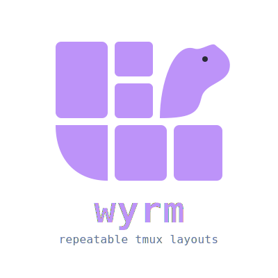

<p align="center">
  
</p>

# wyrm 🐉

Repeatable tmux session layouts from a TOML config — nested split trees,
lifecycle hooks, one static binary.

Drop a `.wyrm.toml` in your project, run `wyrm`, and get the same windows,
panes, and running commands every time.

```toml
[session]
root = "."

[[windows]]
name = "code"

  [[windows.splits]]
  command = "nvim"

  [[windows.splits]]
  type = "h"          # split horizontally: new pane on the right
  size = 30           # it gets 30% of the width
  command = "npm run dev"
```

## Why another one?

| | Language | Config | Runtime deps | Layouts as split *trees* | Lifecycle hooks |
|---|---|---|---|---|---|
| tmuxinator | Ruby | YAML | Ruby | — | ✓ |
| tmuxp | Python | YAML/JSON | Python | — | ✓ |
| smug | Go | YAML | none | — | ✓ |
| **wyrm** | Go | **TOML** | none | **✓** | ✓ |

- **TOML, not YAML** — comment-friendly, no indentation traps.
- **Splits are a tree** — nest splits inside splits with explicit percentage
  sizes, instead of picking from preset layouts.
- **Pane-ID targeting** — layouts come out the same regardless of your
  `base-index` / `pane-base-index` settings.
- **One static binary** — Go stdlib plus a TOML parser, nothing at runtime
  but tmux itself.

## Install

```sh
brew install jskoll/tap/wyrm
```

Or via Go:

```sh
go install github.com/jskoll/wyrm@latest
```

Or build from a clone: `make install` (uses `go install` with a stamped version).

## Usage

```sh
wyrm                       # use .wyrm.toml (or legacy .tmuxconfig) in the cwd
wyrm <name>                # attach/switch directly to a running session by name (tab-completable)
wyrm -config path/to/file  # explicit config
wyrm -kill                 # destroy the session (runs on_project_exit first)
wyrm -pick                 # fuzzy-pick a running session and attach to it
wyrm -edit                 # open the resolved config in $EDITOR, creating one if needed
wyrm -validate             # check the effective config parses and validates, without building a session
wyrm -list                 # list running tmux sessions non-interactively
wyrm -list-configs         # list candidate config file paths (used by shell completion)
wyrm -migrate-config       # move the local config into the shared config directory
wyrm -version
```

If neither `.wyrm.toml` nor `.tmuxconfig` is found, wyrm falls back to
`~/.config/wyrm/default.wyrm.toml` if you've created one, otherwise a
built-in default: a single unnamed window rooted at the current directory —
unless tmux sessions are already running, in which case `wyrm` opens the
session picker (below) instead.

## Editing, validating, and listing

`wyrm -edit` opens the config wyrm would actually use — wherever discovery
(local, shared, or `-config`) finds it — in `$EDITOR` (falling back to
`vi`). If none exists yet, it creates one at the right spot for your
`storage` setting (a local `.wyrm.toml`, or the shared path `-migrate-config`
would use) before opening it. After you save, wyrm re-parses the file and
prints a warning (not an error) if it doesn't validate — you're free to save
a work-in-progress and fix it later.

`wyrm -validate` runs that same parse-and-validate check non-interactively,
without opening an editor or building a session — handy in a pre-commit hook
or CI for a repo that versions its `.wyrm.toml`.

`wyrm -list` prints the running tmux sessions non-interactively (unlike
`-pick`, no interactive UI) for scripts and status bars. Add `-format json`
or `-format toml` for machine-readable output, or `-format names` for a bare
newline-separated list (handy for piping into `fzf` or another tool),
instead of the default aligned table:

```sh
wyrm -list                  # name / window count / attached marker, one per line
wyrm -list -format json | jq .
wyrm -list -format names | fzf | xargs wyrm
```

`wyrm -list-configs` prints the config file paths wyrm knows about — the
local file (if present) and every config in the shared directory (see
below) — regardless of the current `storage` setting. It exists mainly to
back shell completion for `-config`, but works standalone too.

## Storing configs in a shared directory

By default wyrm looks for `.wyrm.toml` in the current directory. If you'd
rather keep all your project configs in one place (e.g. to version them
together, or avoid an untracked file in every repo), set `storage = "shared"`
in wyrm's global settings file at `~/.config/wyrm/config.toml`
(`$XDG_CONFIG_HOME/wyrm/config.toml` if set):

```toml
storage = "shared"
# shared_dir = "~/.config/wyrm/settings"  # optional, this is the default
```

In shared mode, running `wyrm` in a directory named `myproject` looks for
`myproject.wyrm.toml` in the shared directory first, falling back to the
usual local search if it isn't there. `wyrm -migrate-config` moves the
current directory's local config into the shared directory under the right
name for you.

## A custom default config

If no config is found for a project at all (see above), wyrm normally falls
back to a minimal built-in default. To use your own fallback instead, drop a
`default.wyrm.toml` next to the global settings file, at
`~/.config/wyrm/default.wyrm.toml` (`$XDG_CONFIG_HOME/wyrm/default.wyrm.toml`
if set). It's a normal wyrm config — same `[session]` / `[[windows]]` format
as any project config.

## Picking a running session

`wyrm -pick` opens an interactive, fuzzy list of the tmux sessions currently
running (most-recently-active first) and attaches to the one you choose. It's
handy from a plain shell, where tmux's own `choose-tree` isn't available
because you aren't attached to a client yet.

| Key | Action |
|---|---|
| type | fuzzy-filter by session name |
| ↑ / ↓, `Ctrl-P` / `Ctrl-N` | move the selection |
| `Enter` | attach to the selected session (or `switch-client` if you're already in tmux) |
| `Ctrl-X` | kill the selected session (no `on_project_exit` hook — it's a plain tmux kill) |
| `Esc` / `Ctrl-C` | cancel |

The picker is built into the binary — there's no dependency on `fzf` or any
other external tool, keeping wyrm a single static binary.

Window counts are shown in cyan and `(attached)` in green. Set
[`NO_COLOR`](https://no-color.org) (any value) to disable color — the rest
of the picker's styling (bold, dim, the reverse-video selection highlight)
isn't affected, since it isn't color.

If you already know the session's name, `wyrm <name>` skips the picker and
attaches (or `switch-client`s) directly to it — exact match only, no fuzzy
matching. Combined with shell completion (below), this means `wyrm <TAB>`
tab-completes to real running session names.

## Shell completion

Completion scripts for bash, zsh, and fish live in
[`completions/`](https://github.com/jskoll/wyrm/tree/main/completions).
They complete flag names, `-format`'s values, `-config` (to the local file
and every config in the shared directory, via `wyrm -list-configs`), and a
bare argument (to running session names, via `wyrm -list -format names`) —
so any completion involving live state shells back out to wyrm itself
rather than guessing.

`brew install jskoll/tap/wyrm` installs all three automatically. Installing
some other way:

```sh
# bash (needs bash-completion installed)
source completions/wyrm.bash                                 # this shell only
cp completions/wyrm.bash /usr/local/etc/bash_completion.d/    # every shell (macOS + Homebrew's bash-completion)

# zsh
cp completions/_wyrm ~/.zsh/completions/_wyrm   # any directory on your $fpath
# then: autoload -Uz compinit && compinit

# fish
cp completions/wyrm.fish ~/.config/fish/completions/wyrm.fish  # auto-loaded
```

If a session with the same name is already running, wyrm **reattaches** to
it instead of rebuilding it. Otherwise it builds the session fresh, then
attaches.

Run from inside an existing tmux client, wyrm switches the client to the
session instead of nesting one tmux inside another.

## Config reference

### `[session]`

| Key | Type | Default | Description |
|---|---|---|---|
| `name` | string | basename of `root` | tmux session name |
| `root` | string | `.` | Working directory for every window; `$VAR` is expanded |
| `on_project_start` | string | — | Shell command run (via `bash -c`, in `root`) before the session is created |
| `on_project_exit` | string | — | Shell command run before `wyrm -kill` destroys the session |
| `startup_window` | string | first window | Window (name or index) to focus after creation |
| `startup_pane` | int | — | Pane to focus within `startup_window` (uses your `pane-base-index`) |

At least one of `name` / `root` is required.

### `[[windows]]`

| Key | Type | Default | Description |
|---|---|---|---|
| `name` | string | — | Window name |
| `pre_window` | string | — | Command typed into **every pane** before its own command (e.g. `nvm use 18`) |
| `splits` | list | — | Split tree (below) — the recommended layout format |
| `panes` | list | — | Legacy flat pane list (below); ignored when `splits` is set |
| `layout` | string | `tiled` | tmux layout applied after legacy `panes` (`even-horizontal`, `main-vertical`, ...) |

### `[[windows.splits]]` — the split tree

| Key | Type | Default | Description |
|---|---|---|---|
| `type` | string | — | `h`/`horizontal` or `v`/`vertical`. **Omit** to target the pane created by the previous entry (or the window's first pane) without splitting |
| `size` | int | tmux default | Percentage of space given to the new pane (1–99) |
| `command` | string | — | Typed into the pane; entries starting with `#` are comments and skipped |
| `children` | list | — | Nested splits, applied inside this entry's pane |

How the tree is walked: each entry with a `type` splits the pane of the
previous entry at the same level (the window's initial pane for the first
entry). `children` do the same, starting from their parent's pane.

```toml
[[windows]]
name = "dev"

  [[windows.splits]]
  command = "nvim"            # window's first pane

  [[windows.splits]]
  type = "h"                  # split it: new right-hand pane, 30%
  size = 30
  command = "npm run dev"

    [[windows.splits.children]]
    type = "v"                # split the right-hand pane: bottom half
    size = 50
    command = "npm test -- --watch"
```

### `[[windows.panes]]` — legacy flat list

```toml
[[windows]]
name = "tests"
layout = "even-horizontal"

[[windows.panes]]
command = "npm test -- --watch"

[[windows.panes]]
command = "# scratch"          # comment: pane is created, nothing runs
```

Panes split alternately h/v, then `layout` (default `tiled`) evens them out.

More in [`examples/`](https://github.com/jskoll/wyrm/tree/main/examples):
minimal, Node.js, PHP/Symfony, Python, nested splits.

## Security

A wyrm config **executes shell commands by design** — hooks run via
`bash -c`, and pane commands are typed into your shell. Treat config files
with the same trust as a `Makefile` or `.envrc`: don't run one you haven't
read.

## Development

```sh
make build       # build ./wyrm
make test        # unit + integration (integration needs tmux; isolated socket)
make test-unit   # -short: unit tests only
make lint        # golangci-lint + gofmt
```

See [CONTRIBUTING.md](https://github.com/jskoll/wyrm/blob/main/CONTRIBUTING.md)
for the layout and error-handling conventions.

## License

[MIT](LICENSE)
