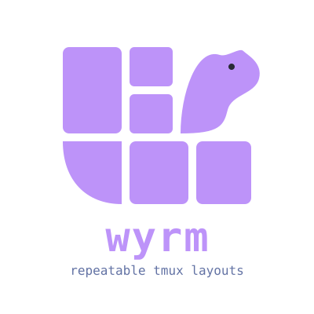

<p align="center">
  
</p>

# wyrm 🐉

Repeatable tmux session layouts from a TOML config — nested split trees,
lifecycle hooks, one static binary.

Drop a `.wyrm.toml` in your project, run `wyrm`, and get the same windows,
panes, and running commands every time.

```toml
[session]
root = "."

[[windows]]
name = "code"

  [[windows.splits]]
  command = "nvim"

  [[windows.splits]]
  type = "h"          # split horizontally: new pane on the right
  size = 30           # it gets 30% of the width
  command = "npm run dev"
```

## Why another one?

| | Language | Config | Runtime deps | Layouts as split *trees* | Lifecycle hooks |
|---|---|---|---|---|---|
| tmuxinator | Ruby | YAML | Ruby | — | ✓ |
| tmuxp | Python | YAML/JSON | Python | — | ✓ |
| smug | Go | YAML | none | — | ✓ |
| **wyrm** | Go | **TOML** | none | **✓** | ✓ |

- **TOML, not YAML** — comment-friendly, no indentation traps.
- **Splits are a tree** — nest splits inside splits with explicit percentage
  sizes, instead of picking from preset layouts.
- **Pane-ID targeting** — layouts come out the same regardless of your
  `base-index` / `pane-base-index` settings.
- **One static binary** — Go stdlib plus a TOML parser, nothing at runtime
  but tmux itself.

## Install

```sh
brew install jskoll/tap/wyrm
```

On Arch Linux, from the AUR:

```sh
yay -S wyrm-bin   # or: paru -S wyrm-bin
```

On Debian/Ubuntu or Fedora/RHEL, grab the `.deb`/`.rpm` from the
[latest release](https://github.com/jskoll/wyrm/releases/latest) and install
it directly:

```sh
sudo dpkg -i wyrm_*_linux_amd64.deb        # Debian/Ubuntu
sudo dnf install ./wyrm_*_linux_amd64.rpm  # Fedora/RHEL
```

Or via Go:

```sh
go install github.com/jskoll/wyrm@latest
```

Or build from a clone: `make install` (uses `go install` with a stamped version).

## Usage

wyrm uses git-style subcommands:

```sh
wyrm                        # use .wyrm.toml (or legacy .tmuxconfig) in the cwd
wyrm up                     # same as bare wyrm, spelled explicitly
wyrm up -n                  # dry run: print the tmux commands and hooks, run neither
wyrm up -d                  # build the session without attaching
wyrm <name>                 # attach to a running session, or start a known project, by name
wyrm -config path/to/file   # explicit config for the default build
wyrm restart                # stop the session and build it again (-n to dry-run, -d to skip attaching)
wyrm kill [name]            # destroy the session (runs on_project_exit first; -n to dry-run)
wyrm pick                   # fuzzy-pick a running session and attach to it
wyrm tui                    # full-screen session manager (browse, preview, kill, rename, start)
wyrm save                   # save the running session's layout as this folder's config
wyrm edit                   # open the resolved config in $EDITOR, creating one if needed
wyrm validate               # check the effective config parses and validates (-strict fails on warnings)
wyrm list                   # list running tmux sessions non-interactively
wyrm list-configs           # list candidate config file paths (used by shell completion)
wyrm migrate-config         # move the local config into the shared config directory
wyrm clone REPO [DEST]      # git clone, then build (and attach to) a session for it
wyrm selfupdate             # download and install the latest release (-check, -version V)
wyrm setup-tmux             # generate or append recommended tmux popup configuration (-a)
wyrm version                # print version
wyrm help                   # usage overview
```

Each subcommand takes its own flags — e.g. `wyrm kill -config path`,
`wyrm list -format json`. Run `wyrm <cmd> -h` to see them.

> **Note (breaking change in 0.3.0):** modes moved from top-level flags to
> subcommands — `wyrm -kill` is now `wyrm kill`, `wyrm -list` is now
> `wyrm list`, and so on. Bare `wyrm`, `wyrm <name>`, and `wyrm -config PATH`
> are unchanged.

`wyrm <name>` first looks for a *running* session by that exact name and
attaches to it. If there isn't one, it looks for a *config* by that name —
local or in the shared directory — and builds it. That's what makes shared
storage worth using: you can start any project from anywhere, without `cd`-ing
to it first.

`wyrm` always reports which config it resolved (on stderr), since discovery has
several layers and an unexpected session is otherwise hard to explain.

If neither `.wyrm.toml` nor `.tmuxconfig` is found, wyrm falls back to
`~/.config/wyrm/default.wyrm.toml` if you've created one, otherwise a
built-in default: a single unnamed window rooted at the current directory.
This always builds (or attaches to) a session for the current folder, even
if unrelated sessions are already running elsewhere — the interactive
picker (below) is only ever shown when you ask for it with `pick`.

## Editing, validating, and listing

`wyrm edit` opens the config wyrm would actually use — wherever discovery
(local, shared, or `-config`) finds it — in `$EDITOR` (falling back to
`vi`). If none exists yet, it creates one at the right spot for your
`storage` setting (a local `.wyrm.toml`, or the shared path `migrate-config`
would use) before opening it. If `$EDITOR` isn't in the environment at all —
which is what a pane launched by the tmux server sees, since the server's
environment never sourced your shell's rc files — wyrm asks your login shell
for it rather than dropping you into `vi`. After you save, wyrm re-parses the
file and prints a warning (not an error) if it doesn't validate — you're free
to save a work-in-progress and fix it later.

`wyrm validate` runs that same parse-and-validate check non-interactively,
without opening an editor or building a session — handy in a pre-commit hook
or CI for a repo that versions its `.wyrm.toml`.

Validation also reports keys wyrm doesn't recognise. A misspelled key is silently dropped by any TOML parser, so a config whose every key was a typo used to validate clean; those now surface as warnings, and `wyrm validate -strict` exits non-zero when there are any — useful in CI. Deprecations (the `.tmuxconfig` filename, the flat `panes` list) count as warnings too.

`wyrm list` prints the running tmux sessions non-interactively (unlike
`pick`, no interactive UI) for scripts and status bars. Add `-format json`
or `-format toml` for machine-readable output, or `-format names` for a bare
newline-separated list (handy for piping into `fzf` or another tool),
instead of the default aligned table:

```sh
wyrm list                  # name / window count / attached marker, one per line
wyrm list -format json | jq .
wyrm list -format names | fzf | xargs wyrm
```

`wyrm list-configs` prints the config file paths wyrm knows about — the
local file (if present) and every config in the shared directory (see
below) — regardless of the current `storage` setting. It exists mainly to
back shell completion for `-config`, but works standalone too.

## Storing configs in a shared directory

By default wyrm looks for `.wyrm.toml` in the current directory. If you'd
rather keep all your project configs in one place (e.g. to version them
together, or avoid an untracked file in every repo), set `storage = "shared"`
in wyrm's global settings file at `~/.config/wyrm/config.toml`
(`$XDG_CONFIG_HOME/wyrm/config.toml` if set):

```toml
storage = "shared"
# shared_dir = "~/.config/wyrm/settings"  # optional, this is the default
```

In shared mode, running `wyrm` in a directory named `myproject` looks for
`myproject.wyrm.toml` in the shared directory first, falling back to the
usual local search if it isn't there. `wyrm migrate-config` moves the
current directory's local config into the shared directory under the right
name for you.

## One config, many directories

`[[wildcard]]` applies one template config to every directory matching a
glob, instead of a `.wyrm.toml` per project — for a folder of similar repos
that should all get the same layout:

```toml
# ~/.config/wyrm/config.toml
[[wildcard]]
pattern = "~/work/*"
config  = "~/.config/wyrm/settings/_client-template.wyrm.toml"
```

`wyrm <name>` (the matched directory's basename) then builds a session
rooted there using the template's windows, and the TUI's Projects panel
marks matches with `~`. See
[`docs/configuration.md`](docs/configuration.md) for the template format and
the recursive `/**` pattern form.

## Cloning a repo into a session

`wyrm clone <repo> [dest]` runs `git clone`, then builds (and attaches to) a
session for the result — the shortcut for "get this repo and start working
in it" in one command instead of `git clone` + `cd` + `wyrm`:

```sh
wyrm clone git@github.com:jskoll/wyrm.git       # clones into ./wyrm, same as git's own default
wyrm clone git@github.com:jskoll/wyrm.git work  # clones into ./work instead
```

It needs `git` on `PATH` — the only other place wyrm depends on a binary
besides tmux, and only for this one explicit subcommand, never by default.
If the destination falls under a `[[wildcard]]` pattern, that template is
used, the same as it would be for any other directory the pattern covers;
otherwise wyrm resolves the config the same way a bare `wyrm up` run from
inside the freshly cloned directory would — the repo's own committed
`.wyrm.toml` if it has one, else your default config.

A linked `git worktree`'s session name is derived from both the main
repository and the worktree's own directory (e.g. `wyrm-feature-x` for a
worktree named `feature-x` off the `wyrm` repo) rather than just the
worktree directory's bare name, so it's clear at a glance which repo a
worktree session belongs to — read directly from `.git`'s own pointer file,
not by shelling to git, so it costs nothing on every `wyrm up`.

## Directories zoxide knows about

If you use [zoxide](https://github.com/ajeetdsouza/zoxide), `wyrm tui` can
list directories from your `cd` history in the Projects panel too — not just
ones with a wyrm config. It's opt-in (off by default) and does nothing at
all unless both a setting and the `zoxide` binary itself are present:

```toml
# ~/.config/wyrm/config.toml
[zoxide]
enabled = true
track   = true   # also call `zoxide add` after building a session
```

See [`docs/configuration.md`](docs/configuration.md) for how zoxide entries
are deduplicated against real projects and what starting one builds.

## A custom default config

If no config is found for a project at all (see above), wyrm normally falls
back to a minimal built-in default. To use your own fallback instead, drop a
`default.wyrm.toml` next to the global settings file, at
`~/.config/wyrm/default.wyrm.toml` (`$XDG_CONFIG_HOME/wyrm/default.wyrm.toml`
if set). It's a normal wyrm config — same `[session]` / `[[windows]]` format
as any project config.

## Targeting a different tmux

By default wyrm talks to the default tmux server, via whatever `tmux` it
finds on `PATH`. To point it at a separate server or a different binary —
a wrapper/fork like `byobu` or `psmux`, or a specific install — add a
`[tmux]` block to the same global settings file:

```toml
[tmux]
socket  = "work"                    # tmux -L work
command = "/opt/tmux/bin/tmux"      # binary to invoke instead of "tmux"
```

`WYRM_TMUX_SOCKET` / `WYRM_TMUX_COMMAND` override these per-invocation and
take priority over the file. Every tmux call wyrm makes for the run —
including the final `attach-session` handoff — goes through the same
configured server and binary. See [`docs/configuration.md`](docs/configuration.md)
for the full reference.

## Picking a running session

`wyrm pick` opens an interactive, fuzzy list of the tmux sessions currently
running (most-recently-active first) and attaches to the one you choose. It's
handy from a plain shell, where tmux's own `choose-tree` isn't available
because you aren't attached to a client yet.

It is `wyrm tui` in a compact two-panel form — Sessions over Windows, with the
filter already open so typing narrows the list immediately. Same program, same
keys: anything you learn in one works in the other.

| Key | Action |
|---|---|
| type | fuzzy-filter the focused panel |
| ↑ / ↓, `j` / `k` | move the selection |
| `Enter` | attach to the selected session (or `switch-client` if you're already in tmux), landing on the selected window |
| `Tab`, `1` / `2` | move between the Sessions and Windows panels |
| `x` | kill the selected session or window, after a `y`/`n` confirm (no `on_project_exit` hook — it's a plain tmux kill) |
| `r` | rename the selection |
| `Esc` | clear the filter |
| `?` | the full key reference |
| `q`, `Ctrl-C` | quit |

```
┌Sessions──────────────┐┌%3 nvim───────────────────────────────┐
│  api-server     (2w) ││                                      │
│● wyrm           (3w) ││  … live preview of the selected pane │
│  notes          (1w) ││                                      │
└──────────────────────┘│                                      │
┌Windows───────────────┐│                                      │
│0: code               ││                                      │
│1: server             ││                                      │
└──────────────────────┘└──────────────────────────────────────┘
/wyr_
```

Both interfaces are built into the binary — there's no dependency on `fzf` or
any other external tool, keeping wyrm a single static binary. Colors come from
the same optional `theme.toml` the TUI uses.

> **Note (changed in 0.6.0):** `pick` used to be a separate implementation with
> its own bindings (`Ctrl-X` to kill, `Ctrl-W` for windows, `Ctrl-U` to clear
> the filter). Those are now `x`, the Windows panel, and `Esc`. Two UIs offering
> the same actions under different keys was the reason for the change.

If you already know the session's name, `wyrm <name>` skips the picker and
attaches (or `switch-client`s) directly to it — exact match only, no fuzzy
matching. Combined with shell completion (below), this means `wyrm <TAB>`
tab-completes to real running session names.

A project can also declare `aliases` in its `[session]` block — short, fixed
names that resolve exactly like the real one (`wyrm dot` for a project named
`dotfiles`), without shifting as other projects come and go. See
[`docs/configuration.md`](docs/configuration.md).

## The session manager TUI

`wyrm tui` opens a full-screen, keyboard-driven session manager in the spirit
of lazygit. Where `pick` is a one-shot "choose and attach", the TUI is for
_browsing and managing_ everything at once — your project configs, the running
sessions, and the windows and panes inside them — with a live preview of the
selected pane.

```
┌ Projects ─────┐┌ %1 nvim ─────────────────────────┐
│ ● webapp      ││ (live capture of the selected     │
│   dotfiles    ││  pane — refreshed every second —  │
├ Sessions ─────┤│  or, on the Projects panel, the   │
│ ● webapp  2w  ││  selected config's contents)      │
│   notes   1w  ││                                   │
├ Windows ──────┤│                                   │
│ 0: code       ││                                   │
│ 1: servers    ││                                   │
├ Panes ────────┤│                                   │
│ %1 nvim       ││                                   │
│ %2 npm        ││                                   │
└───────────────┘└───────────────────────────────────┘
 ↵: attach  x: kill  r: rename  n: new-win  L: layout  tab/1-4: focus  ?: help
```

The four left panels form a hierarchy: **Projects** (every `.wyrm.toml` wyrm can
discover — the local one plus the shared directory, marked `●` when a session by
that name is running) → **Sessions** (running now) → **Windows** → **Panes**.
Windows track the selected session and panes track the selected window. The main
panel previews the selection: the live pane contents (via `capture-pane`) for the
session panels, or the config file's contents on the Projects panel. Focus starts
on **Sessions** — the usual reason to open the TUI is to get back to something
already running.

| Key | Action |
|---|---|
| `Tab` / `Shift-Tab`, `1`–`4` | move focus between panels |
| `↑` / `↓`, `j` / `k` | move the selection in the focused panel |
| `PgUp` / `PgDn`, `g` / `G` | move a screenful / jump to the first or last entry |
| `/` | filter the focused panel (`Esc` clears it) |
| `f` | find a pane across every session at once — see below |
| `Enter` | attach — lands on the exact window/pane under the cursor (or, on Projects, starts/attaches the config's session) |
| `x` | kill the focused session / window / pane (or, on Projects, stop the session running `on_project_exit`) — with a confirm |
| `r` | rename the focused session or window |
| `n` | new window in the current session |
| `L` | cycle the focused window through tmux's standard layouts |
| `z` | toggle zoom on the focused pane |
| `e` | edit the selected project's config in `$EDITOR` |
| `R` | reload the project and session lists |
| `M` | open the context menu for the current selection |
| `m` | toggle mouse capture |
| `?` | show the full keyboard-shortcut help overlay (scrollable) |
| `q` / `Ctrl-C` | quit |

Press `?` at any time for a full-screen cheat sheet of every binding — laid out
in two columns, or one on a narrow terminal, and scrollable (`↑`/`↓` or `j`/`k`,
`Esc` to close) when it's taller than the screen. Like
`pick`, attaching from the TUI uses `switch-client` when you're already
inside tmux and `attach-session` otherwise. When run inside tmux, the pane the
TUI itself occupies shows a placeholder instead of a preview, to avoid capturing
the TUI into its own view. It also pairs well with tmux's `display-popup` for a
floating session manager over your current work:

```sh
# ~/.tmux.conf — prefix + g opens the session manager in a popup
bind g display-popup -d "#{pane_current_path}" -w 80% -h 80% -E "wyrm tui"
```

### Finding a pane across every session

The four panels drill down one level at a time — Sessions → Windows → Panes
— which means reaching a specific pane three sessions away still means
navigating there step by step. `f` skips that: it opens a searchable list of
every pane on the server at once (session ▸ window ▸ pane, with its running
command), the same job tmux's own `choose-tree -Z` does. Type to narrow,
`↑`/`↓` to move, `Enter` to attach directly to that pane, `Esc` to close.
Full-TUI only — `wyrm pick`'s compact form stays the two-panel chooser it's
meant to be.

### Mouse

The mouse works throughout, and is on by default:

| Action | Effect |
|---|---|
| Click | focus that panel and select the row |
| Double-click | attach, landing on the clicked window/pane (on Projects: start the config's session) |
| Right-click, or `M` | open a context menu for the row under the pointer |
| Wheel | scroll the panel under the pointer |

The context menu offers the actions for whatever you clicked — the same set the
panel's footer advertises, so it teaches the keys rather than replacing them.
It's driveable either way: `↑`/`↓` and `Enter`, or just click an entry. `Esc`,
or a click anywhere else, dismisses it.

**If right-click does nothing, your terminal is keeping it.** Several emulators
reserve the right button for their own context menu and never forward button 3
to the application — iTerm2 does this by default, so right-click never reaches
wyrm no matter what tmux is set to. `M` opens the same menu from the keyboard
and always works. To check whether your terminal forwards it, turn on mouse
reporting in a shell and watch what arrives:

```sh
printf '\033[?1000h\033[?1006h'; cat -v   # click around; Ctrl-C when done
printf '\033[?1000l\033[?1006l'           # then turn it back off
```

A left click prints something like `^[[<0;42;9M`. If a right click prints
nothing, the terminal swallowed it.

```
├ Sessions ─────┤
│ ● webapp  2w  │
│   notes ╭──────────────────╮
│   api   │ Attach         ↵ │
├ Windows ┤ Rename session r │
│ 0: code │ New window     n │
│ 1: serve│ Kill session   x │
└─────────╰──────────────────╯
```

Capturing the mouse takes click-drag text selection away from your terminal.
Press `m` to hand it back for the rest of the session (most terminals also
select on `Shift`-drag while it's captured), or turn it off permanently:

```toml
# ~/.config/wyrm/config.toml
[tui]
mouse = false
```

### Waiting agents

A pane running an AI coding agent gets a marker in every panel that contains it,
so a session that needs you is visible without opening it:

| Marker | Meaning |
|---|---|
| `⏸` | stopped on a prompt it can't answer itself — a permission request, a plan approval, a question |
| `✓` | finished its turn and is waiting for the next instruction |

A busy agent is deliberately unmarked: an indicator lit on every agent pane all
the time is one nobody reads. Windows and sessions take the state of their most
urgent pane, so `⏸` on a session means *something* in there is blocked.

```
├ Sessions ─────┤
│ ● webapp  2w ⏸│   <- an agent is waiting on an answer
│   notes   1w ✓│   <- an agent finished; nothing is blocked
│   api     3w  │   <- no agent, or one that's still working
```

Detection reads the bottom of each agent pane with `capture-pane` — only panes
whose command matches, never every pane on the server — on the same 3-second
tick as the session list. It recognises `claude` out of the box; point it at
other agents, or switch it off entirely, in `~/.config/wyrm/config.toml`:

```toml
[tui.agent]
enabled  = true                  # false stops the scanning (and its cost)
commands = ["claude", "aider"]   # #{pane_current_command} values to inspect
```

Because it reads what's on screen, an agent displaying a *screenshot* of a
prompt — reviewing a diff of prompt-handling code, say — can be misread. The
detector only matches the agent's own prompt chrome, never prose, which keeps
that rare; and it self-corrects on the next refresh.

### Colors

The TUI ships with [Nord](https://www.nordtheme.com): frost blue on the focused
panel, dim polar-night gray on the rest, aurora yellow while a filter is active,
and a gray selection band that leaves each row's own colors (teal window
indices, green "running" dots) intact.

Override any of it with `~/.config/wyrm/theme.toml`
(`$XDG_CONFIG_HOME/wyrm/theme.toml` if set) — every role is optional, and the
ones you leave out keep their Nord default:

```toml
accent   = "#88c0d0"  # focused panel border + title, live preview title
subtle   = "#4c566a"  # blurred borders, hints, help footer
filter   = "#ebcb8b"  # the panel being filtered: border, title, prompt
selected = "#434c5e"  # selection band in the focused panel
text     = "#eceff4"  # text on the selection band
trail    = "#3b4252"  # selection band in the other panels
index    = "#8fbcbb"  # window indices and pane IDs
active   = "#a3be8c"  # running / attached dots
error    = "#bf616a"  # failed actions
blocked  = "#ebcb8b"  # an agent waiting on an answer (⏸)
idle     = "#8fbcbb"  # an agent that finished its turn (✓)
```

Values are `#rgb` or `#rrggbb`. A misspelled role or an unparseable color is an
error rather than a silently ignored line — `wyrm tui` says which one and
exits, since the alt screen would otherwise wipe the message on its way up.

Colors are literal hex rather than terminal palette indices, so a theme looks
the same wherever it runs; Lipgloss degrades them on terminals without true
color and drops them entirely under [`NO_COLOR`](https://no-color.org).

`wyrm tui` and `wyrm pick` are the same [Charm](https://charm.sh) stack
program (Bubble Tea / Lipgloss); the core build/attach path stays free of it,
so `wyrm up` never renders anything.

## Saving a running session

`wyrm save` snapshots a running tmux session's windows, split layout, and
sizes into a new config for the current folder — the reverse of building a
session from one. Run it from inside the session you want to capture, or
from a plain shell in the session's folder (it looks up the session the same
way a bare `wyrm` would).

```sh
wyrm save                  # writes .wyrm.toml (or the shared-storage path)
wyrm save -config PATH     # write to PATH instead of the resolved location
```

tmux keeps no record of what was originally typed into a pane, so each
split's `command` is captured as whatever program is currently running in
that pane's foreground (`nvim`, `npm`, ...) — the same approach tools like
tmuxp's `freeze` use. A pane sitting at an idle shell prompt is captured as
having no command, rather than as running your shell — replaying `zsh` into a
shell would just nest a second one. That's usually enough to relaunch the same programs,
but it won't recover one-off shell commands that have already finished, and
it can't capture `pre_window`, `on_project_start`/`on_project_exit`, or
comments — those are yours to add by hand afterward, e.g. with `wyrm edit`.

Like `migrate-config`, `save` refuses to overwrite an existing config
rather than silently discarding hooks or comments you've already written —
remove or rename the file first if you want to re-save over it.

## Shell completion

Completion scripts for bash, zsh, and fish live in
[`completions/`](https://github.com/jskoll/wyrm/tree/main/completions).
They complete the first token (subcommand names, plus running session names
for `wyrm <name>`, via `wyrm list -format names`), `-format`'s values, and
`-config` (to the local file and every config in the shared directory, via
`wyrm list-configs`) — so any completion involving live state shells back
out to wyrm itself rather than guessing.

`brew install jskoll/tap/wyrm` installs all three automatically. Installing
some other way:

```sh
# bash (needs bash-completion installed)
source completions/wyrm.bash                                 # this shell only
cp completions/wyrm.bash /usr/local/etc/bash_completion.d/    # every shell (macOS + Homebrew's bash-completion)

# zsh
cp completions/_wyrm ~/.zsh/completions/_wyrm   # any directory on your $fpath
# then: autoload -Uz compinit && compinit

# fish
cp completions/wyrm.fish ~/.config/fish/completions/wyrm.fish  # auto-loaded
```

If a session with the same name is already running, wyrm **reattaches** to
it instead of rebuilding it. Otherwise it builds the session fresh, then
attaches.

Run from inside an existing tmux client, wyrm switches the client to the
session instead of nesting one tmux inside another.

## Config reference

### `[session]`

| Key | Type | Default | Description |
|---|---|---|---|
| `name` | string | basename of `root` | tmux session name |
| `root` | string | `.` | Working directory for every window; `$VAR` is expanded |
| `on_project_start` | string | — | Shell command run (via your $SHELL, or sh, in `root`) before the session is created |
| `on_project_exit` | string | — | Shell command run before `wyrm kill` destroys the session |
| `on_project_first_start` | string | — | Runs alongside `on_project_start`, but only the very first time this project is ever started (tracked in `~/.config/wyrm/state.toml`) |
| `on_project_restart` | string | — | Runs alongside `on_project_start` on every start after the first |
| `startup_window` | string | first window | Window (name or index) to focus after creation. Without it the session opens on the first window, focused on its first pane |
| `startup_pane` | int | — | Pane to focus within `startup_window` (uses your `pane-base-index`) |
| `aliases` | array | — | Additional exact-match names `wyrm <name>` resolves to this project |
| `enable_pane_titles` | bool | `false` | Turn on tmux's live pane-border status line (`pane-border-status`/`-format`) |
| `pane_title_position` | string | `top` | `top` or `bottom`; only meaningful with `enable_pane_titles` |
| `pane_title_format` | string | `#{pane_index}: #{pane_current_command}` | tmux format string for the pane-border line |

At least one of `name` / `root` is required.

### `[[windows]]`

| Key | Type | Default | Description |
|---|---|---|---|
| `name` | string | — | Window name |
| `pre_window` | string | — | Command typed once into **every pane of the window**, before that pane's own command (e.g. `nvm use 18`) |
| `post_window` | string | — | Shell command **run** (not typed) once all of the window's panes and their commands exist — e.g. waiting for a port to open |
| `splits` | list | — | Split tree (below) — the recommended layout format |
| `panes` | list | — | Legacy flat pane list (below); ignored when `splits` is set |
| `layout` | string | `tiled` | tmux layout applied after legacy `panes` (`even-horizontal`, `main-vertical`, ...). Ignored when `splits` is set — a named layout would discard the tree's sizes — and wyrm warns if you set both |

### `[[windows.splits]]` — the split tree

| Key | Type | Default | Description |
|---|---|---|---|
| `type` | string | — | `h`/`horizontal` or `v`/`vertical`. **Omit** to target the pane created by the previous entry (or the window's first pane) without splitting |
| `size` | int | tmux default | Percentage of space given to the new pane (1–99) |
| `command` | string | — | Typed into the pane; entries starting with `#` are comments and skipped |
| `children` | list | — | Nested splits, applied inside this entry's pane |

How the tree is walked: each entry with a `type` splits the pane of the
previous entry at the same level (the window's initial pane for the first
entry). `children` do the same, starting from their parent's pane.

Every entry at a level is created before wyrm descends into any of their
`children`, so a `size` is always a share of the space its own level was given
— not of whatever an earlier sibling's children happened to leave behind. This
is what lets `wyrm save` capture a nested layout and rebuild it unchanged.

Give the *first* entry at a level a `type` and it splits the pane it was handed
rather than filling it, leaving that pane an empty shell; wyrm warns when a
config does that. Omit the `type` on the first entry to put it in the pane
itself.

```toml
[[windows]]
name = "dev"

  [[windows.splits]]
  command = "nvim"            # window's first pane

  [[windows.splits]]
  type = "h"                  # split it: new right-hand pane, 30%
  size = 30
  command = "npm run dev"

    [[windows.splits.children]]
    type = "v"                # split the right-hand pane: bottom half
    size = 50
    command = "npm test -- --watch"
```

### `[[windows.panes]]` — legacy flat list

> **Deprecated.** The flat `panes` list (and the `.tmuxconfig` filename) are
> retained for backward compatibility but are slated for removal in 1.0. New
> configs should use the `splits` tree, which is strictly more expressive.
> `wyrm save` only ever emits `splits`.

```toml
[[windows]]
name = "tests"
layout = "even-horizontal"

[[windows.panes]]
command = "npm test -- --watch"

[[windows.panes]]
command = "# scratch"          # comment: pane is created, nothing runs
```

Panes split alternately h/v, then `layout` (default `tiled`) evens them out.

More in [`examples/`](https://github.com/jskoll/wyrm/tree/main/examples):
minimal, Node.js, PHP/Symfony, Python, nested splits.

## How wyrm compares

The table at the top covers the basics — language, config format, runtime
deps, split trees, hooks. This one goes wider, against
[tmuxinator](https://github.com/tmuxinator/tmuxinator) (Ruby/YAML),
[tmuxp](https://github.com/tmux-python/tmuxp) (Python/YAML/JSON),
[smug](https://github.com/ivaaaan/smug) (Go/YAML), and
[sesh](https://github.com/joshmedeski/sesh) (Go, zoxide-based).

| Feature | wyrm | tmuxinator | tmuxp | smug | sesh |
|---|---|---|---|---|---|
| Nested split-tree layout w/ explicit sizes | ✅ | ❌ (preset layouts) | ❌ (preset layouts) | ❌ (preset layouts) | ❌ (single window/pane per config) |
| Pane-ID targeting (robust to base-index) | ✅ | ❌ | ❌ | ❌ | n/a |
| Save/freeze a running session to config | ✅ `wyrm save` | ❌ | ✅ `tmuxp freeze` | ❌ | ❌ |
| Built-in full-screen TUI (browse/kill/rename/preview) | ✅ `wyrm tui` | ❌ | ❌ | ❌ | ✅ (picker; flatter, no window/pane management) |
| Fuzzy session picker, no external tool needed | ✅ `wyrm pick` | ❌ | ❌ | ❌ | ✅ (built-in picker) |
| AI-coding-agent waiting/blocked detection | ✅ | ❌ | ❌ | ❌ | ❌ |
| Config validation w/ typo detection | ✅ `validate -strict` | ❌ | ❌ | ❌ | partial (JSON Schema autocomplete) |
| Self-update | ✅ `wyrm selfupdate` | ❌ | ❌ | ❌ | ❌ |
| Custom tmux socket / binary override | ✅ `[tmux]` | ✅ `tmux_options`/`tmux_command` | ✅ | ❌ | ✅ `tmux_command` |
| Detached start (build without attaching) | ✅ `-d` | ✅ `attach: false` | ✅ `-d` | ✅ | n/a |
| First-start vs. restart hook distinction | ✅ `on_project_first_start`/`restart` | ✅ | ❌ | ❌ | ❌ |
| Pane titles / live pane-border status | ✅ `enable_pane_titles` | ✅ `enable_pane_titles` | ❌ | ❌ | n/a |
| Wildcard config (one template → many directories) | ✅ `[[wildcard]]` | ❌ | ❌ | ❌ | ✅ `[[wildcard]]` |
| Session aliases | ✅ `session.aliases` | ❌ | ❌ | ❌ | ✅ |
| Git-aware session naming | ✅ (worktree-aware) | ❌ | ❌ | ❌ | ✅ (git remote-based) |
| Clone-and-connect (`clone <repo>` → session) | ✅ `wyrm clone` | ❌ | ❌ | ❌ | ❌ (`sesh mkdir` is close but doesn't clone) |
| zoxide/frecency directory discovery | ✅ opt-in, `wyrm tui` only | ❌ | ❌ | ❌ | ✅ (core to sesh's design) |
| Multi-format config (YAML/JSON, cross-tool import) | ❌ (TOML only, by design) | n/a | ✅ (also reads tmuxinator/teamocil files) | n/a | n/a |
| Plugin/extension system | ❌ (hooks cover it — see below) | ❌ | ✅ (Python plugin system) | ❌ | ❌ |
| Scripting/API shell | ❌ | ❌ | ✅ `tmuxp shell` (libtmux) | ❌ | ❌ |

A few calls worth explaining:

- **wyrm's split trees stay the one thing none of these match.** Every other
  tool here either picks from tmux's preset layouts (`tiled`,
  `main-vertical`, ...) or, in sesh's case, doesn't lay out multiple panes at
  all. wyrm's `[[windows.splits]]` tree with per-pane `size` and arbitrary
  nesting is the only one of these that can round-trip a saved session back
  into an identical nested layout.
- **sesh is the closest match on the discovery side** (wildcards, aliases,
  zoxide, git-aware naming) — wyrm closed that gap deliberately, matching
  sesh's model rather than reinventing one, while keeping its own layout
  format as the template a wildcard or clone builds from.
- **Multi-format config is the one gap left open on purpose.** wyrm stays
  TOML-only; tmuxp's ability to read YAML/JSON/tmuxinator/teamocil files is
  real interoperability value if you're migrating, but it cuts against
  wyrm's "one format, strictly validated" design.
- **No plugin system, and not planning one.** wyrm's hooks
  (`on_project_start`, `on_project_first_start`, `on_project_restart`,
  `on_project_exit`, `pre_window`, `post_window`) already cover what a
  plugin would typically be for — see [Security](#security) below.

## Security

A wyrm config **executes shell commands by design** — hooks run via
your `$SHELL` (falling back to `sh`), and pane commands are typed into your shell. Treat config files
with the same trust as a `Makefile` or `.envrc`: don't run one you haven't
read.

wyrm has no plugin system by design, for the same reason: `on_project_start`,
`on_project_first_start`, `on_project_restart`, `on_project_exit`,
`pre_window`, and `post_window` already cover what a plugin would typically
be for (env prep, external tools, waiting on a condition, notifications) at
one line of TOML each, without adding a separate mechanism for discovering
and running third-party code. See
[`docs/configuration.md`](docs/configuration.md) for each hook's exact
timing.

## Development

```sh
make build       # build ./wyrm
make test        # unit + integration (integration needs tmux; isolated socket)
make test-unit   # -short: unit tests only
make lint        # golangci-lint + gofmt
```

See [CONTRIBUTING.md](https://github.com/jskoll/wyrm/blob/main/CONTRIBUTING.md)
for the layout and error-handling conventions.

## License

[MIT](LICENSE)
